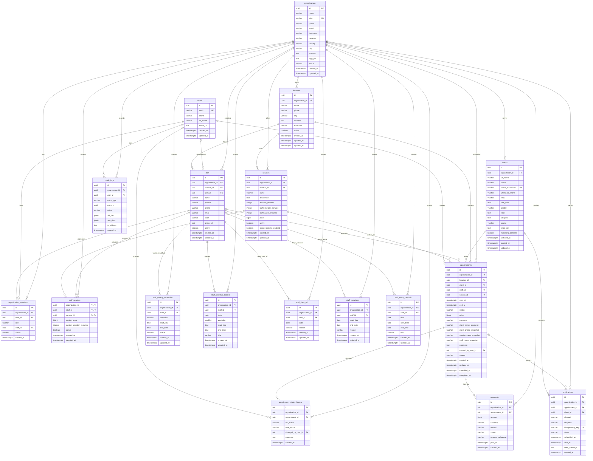

# Схема базы данных KARO Booking

## Назначение документа

Документ фиксирует логическую ER-модель будущей PostgreSQL-базы KARO Booking. Это проектирование, а не готовая миграция: типы, связи и ограничения должны быть перенесены в SQL отдельным этапом после создания Supabase-проекта.

Модель рассчитана на multi-tenant SaaS:

- `organizations` является границей арендатора (tenant boundary);
- `users` хранит глобальную учётную запись платформы;
- `organization_members` связывает пользователя с одной или несколькими организациями и задаёт его роль в каждой из них;
- каждая операционная сущность содержит `organization_id`, даже если организацию можно косвенно определить через родительскую запись;
- дочерняя запись не может ссылаться на сущность другой организации;
- исторические записи не зависят от последующего переименования клиента, сотрудника или услуги.

В модели 18 физических таблиц. Упоминаемое в требованиях слово `schedules` — логическая группа пяти таблиц графика, а не отдельная сущность.

## Условные обозначения

| Обозначение | Смысл |
|---|---|
| `PK` | первичный ключ |
| `FK` | внешний ключ |
| `UK` | уникальное значение или часть уникального ключа |
| `||` | ровно одна запись |
| `o|` | ноль или одна запись |
| `o{` | ноль или много записей |

Поля `price`, `custom_price` и `amount` на диаграмме имеют тип `bigint`: значение хранится в минимальных денежных единицах, без floating point. Все временные метки аудита и записей имеют тип `timestamptz`.

## ER-диаграмма

`organization_members.staff_id`, `staff.user_id`, `services.location_id`, `appointments.created_by_user_id`, `appointment_status_history.changed_by_user_id`, `notifications.appointment_id`, `notifications.client_id` и `audit_logs.user_id` допускают `NULL`. На ER-диаграмме nullable не кодируется на уровне каждого поля, поэтому это перечислено явно.

## Кардинальности и смысл связей

### Организация, филиалы и пользователи

- Одна организация имеет от нуля до многих филиалов, сотрудников, услуг, клиентов и записей.
- Один пользователь может состоять в нескольких организациях. Пара `organization_members (organization_id, user_id)` уникальна, поэтому внутри одной организации у пользователя только одно активное членство и одна роль.
- Для роли `staff` связь с профилем `staff` обязательна. `owner` или `admin` также может иметь `staff_id`, если одновременно оказывает услуги; для viewer поле обычно равно `NULL`.
- Профиль сотрудника может существовать без учётной записи. Это необходимо для мастеров, которые отображаются в расписании, но ещё не входят в административную панель.
- `staff.user_id` допускает повторное использование одного пользователя в разных организациях, но сочетание `(organization_id, user_id)` должно быть уникальным среди непустых значений.
- Сотрудник имеет основной филиал. Услуга может быть организационной (`location_id IS NULL`) или доступной только в конкретном филиале.

### Услуги, сотрудники и клиенты

- `staff_services` реализует связь многие-ко-многим между сотрудниками и услугами.
- Составной первичный ключ `staff_services (organization_id, staff_id, service_id)` запрещает повторное назначение одной услуги одному сотруднику.
- `custom_price` и `custom_duration_minutes` переопределяют стандартные значения услуги для конкретного сотрудника; `NULL` означает использование значения из `services`.
- Клиент принадлежит ровно одной организации. Нормализованный телефон должен быть уникальным внутри организации, но одинаковый человек может иметь независимые карточки в разных организациях.

### Записи и зависимые события

- Каждая запись относится ровно к одной организации, одному филиалу, клиенту, сотруднику и услуге.
- Один клиент, сотрудник или услуга может участвовать во многих записях.
- `created_by_user_id` необязателен: `NULL` обозначает публичную запись или системную операцию без авторизованного пользователя.
- Одна запись имеет много событий `appointment_status_history`, платежей и уведомлений.
- `old_status` в первом событии истории может быть `NULL`; `new_status` обязателен.
- Уведомление связано минимум с записью или клиентом, может быть связано с обоими объектами. Общая рассылка организации должна моделироваться отдельной кампанией, а не строкой без получателя.
- `audit_logs.entity_type + entity_id` является полиморфной ссылкой. Обычный внешний ключ на произвольную таблицу для неё не создаётся; корректность обеспечивается серверным audit-механизмом.

### График сотрудника

- `staff_weekly_schedules` содержит ноль или несколько рабочих интервалов на день недели. Несколько интервалов позволяют описать раздельную смену.
- `staff_schedule_breaks` содержит либо повторяющийся перерыв по `weekday`, либо разовый перерыв по `date`.
- `staff_days_off` закрывает базовый недельный график конкретной даты; явно добавленный extra interval может открыть ограниченную смену.
- `staff_vacations` закрывает включительный диапазон дат.
- `staff_extra_intervals` добавляет рабочий интервал на конкретную дату, в том числе вне обычной недельной смены.
- Итоговая доступность вычисляется так: отпуск закрывает дату; выходной убирает недельные интервалы; extra intervals добавляют явные окна; затем вычитаются перерывы и уже занятое время.

## Tenant ownership

### Граница данных

`users` — единственная глобальная пользовательская таблица. Она не содержит `organization_id`, потому что одна учётная запись может состоять в нескольких организациях. `organizations` задаёт сам tenant. Все остальные бизнес-таблицы принадлежат организации напрямую.

| Группа | Таблицы | Правило владения |
|---|---|---|
| Каталог организации | `locations`, `staff`, `services`, `staff_services`, `clients` | обязательный `organization_id` |
| Операционные данные | `appointments`, `appointment_status_history`, `payments`, `notifications` | обязательный `organization_id`, совпадающий с родителем |
| Графики | все таблицы `staff_*schedule*`, `staff_days_off`, `staff_vacations`, `staff_extra_intervals` | обязательный `organization_id`, совпадающий с организацией сотрудника |
| Доступ | `organization_members` | организация определяется членством |
| Аудит | `audit_logs` | каждое событие привязано к организации, даже если `user_id` отсутствует |

Прямой `organization_id` в дочерних таблицах намеренно дублирует косвенную принадлежность. Это даёт простой и индексируемый RLS-фильтр, ускоряет типовые tenant-запросы и позволяет проверять границу организации непосредственно в каждом `INSERT`, `UPDATE` и `DELETE`.

Для защиты от cross-tenant ссылок одного UUID недостаточно. На родительских tenant-таблицах требуется дополнительная уникальность `(organization_id, id)`, а дочерние ссылки должны быть составными:

- `(organization_id, staff_id)` → `staff (organization_id, id)`;
- `(organization_id, service_id)` → `services (organization_id, id)`;
- `(organization_id, client_id)` → `clients (organization_id, id)`;
- `(organization_id, appointment_id)` → `appointments (organization_id, id)`;
- `(organization_id, location_id)` → `locations (organization_id, id)`.

Такая схема не позволяет подставить реально существующий UUID объекта из другой организации даже при ошибке серверной логики. RLS остаётся обязательным вторым слоем защиты.

## Snapshot-связи и историческая целостность

`appointments.client_id`, `staff_id` и `service_id` указывают на актуальные карточки, но бизнес-документ записи должен сохранять исходное состояние. Для этого используются:

- `client_name_snapshot`;
- `client_phone_snapshot`;
- `service_name_snapshot`;
- `staff_name_snapshot`;
- `price` как зафиксированная стоимость записи;
- `currency` как валюта зафиксированной стоимости;
- `start_at` и `end_at` как зафиксированный временной интервал.

Snapshot-поля заполняются в одной транзакции с созданием записи и после этого не синхронизируются с каталогами. Переименование услуги, изменение цены, телефона клиента или имени сотрудника не должно менять старые записи, чеки, уведомления и аналитику.

Живые внешние ключи нужны для навигации, фильтрации и аналитики, а snapshots — для отображения исторического факта. Если карточка клиента объединяется с дублем, это отдельная контролируемая серверная операция; snapshot старой записи остаётся неизменным.

`appointment_status_history` является append-only историей переходов. Текущее значение хранится в `appointments.status`, а история фиксирует предыдущее и новое состояние, автора, комментарий и время перехода.

## Ключевые ограничения

### Ограничения доменных значений

- `organizations.status`: `active`, `suspended`, `archived`.
- `organization_members.role`: `owner`, `admin`, `staff`, `viewer`.
- `appointments.status`: `new`, `confirmed`, `in_progress`, `completed`, `cancelled`, `no_show`.
- `appointments.source`: `website`, `admin`, `whatsapp`, `phone`, `import`, `api`.
- `payments.method`: `cash`, `card`, `kaspi`, `bank_transfer`, `online`.
- `payments.status`: `pending`, `paid`, `refunded`, `cancelled`.
- `notifications.channel`: `whatsapp`, `sms`, `email`, `push`.
- `weekday` находится в диапазоне ISO `1..7`: `1 = Monday`, `7 = Sunday`.
- `duration_minutes > 0`, buffer-значения `>= 0`, денежные значения `>= 0`.
- Все интервалы удовлетворяют `start < end`; отпуск удовлетворяет `start_date <= end_date`.
- У `staff_schedule_breaks` заполнено ровно одно из полей `date` и `weekday`.
- `cancelled_at` требуется для статуса `cancelled`, `completed_at` — для статуса `completed`; для остальных статусов соответствующее поле должно быть `NULL`.

Доменные статусы рекомендуется реализовать PostgreSQL `CHECK`-ограничениями, а не enum-типами: это упрощает контролируемое расширение значений в SaaS без изменения типа во множестве таблиц.

### Уникальность

- `organizations.slug` уникален без учёта регистра.
- `organization_members (organization_id, user_id)` уникален.
- `organization_members (organization_id, staff_id)` уникален для непустого `staff_id`.
- `staff (organization_id, user_id)` уникален для непустого `user_id`.
- `staff_services (organization_id, staff_id, service_id)` — составной первичный ключ.
- `clients (organization_id, normalized_phone)` уникален для непустого нормализованного телефона. Нормализация выполняется сервером до записи.
- `staff_days_off (organization_id, staff_id, date)` уникален.
- `(payments.organization_id, payments.method, payments.external_reference)` уникален для непустого внешнего ID.

### Защита от пересечения записей

Интервалы рассматриваются как полуоткрытые: `[start_at, end_at)`. Поэтому запись `09:00–10:00` не конфликтует с записью `10:00–11:00`.

Надёжная защита должна находиться в PostgreSQL, а не только в интерфейсе:

1. проверить `start_at < end_at`;
2. создать GiST exclusion constraint по `organization_id`, `staff_id` и `tstzrange(start_at, end_at, '[)')`;
3. применять ограничение только к записям, где `status <> 'cancelled'`;
4. создавать или переносить запись в транзакции и преобразовывать constraint violation в понятную доменную ошибку.

Отменённая запись остаётся в истории, но больше не блокирует время. Проверка свободного слота в приложении полезна для UX, однако не заменяет constraint: два параллельных запроса могут одновременно пройти предварительную проверку.

Если buffers должны физически блокировать соседнее время, в миграции следует либо хранить зафиксированные границы занятости, либо строить exclusion range из snapshot-значений buffers. Изменение текущей услуги не должно ретроактивно менять занятость уже созданной записи.

### Валидность рабочего графика

- Недельные и дополнительные интервалы одного сотрудника не должны пересекаться внутри одинакового дня.
- Перерыв должен пересекать хотя бы один рабочий интервал соответствующего дня; решение о разрешении нескольких смежных перерывов должно быть единым для API и базы.
- Для повторяющихся интервалов конфликт проверяется по `(organization_id, staff_id, weekday)` и диапазону минут суток.
- Для датированных интервалов конфликт проверяется по `(organization_id, staff_id, date)`.
- Отпуск полностью закрывает дату. Выходной убирает недельный график, но явно добавленный extra interval может открыть ограниченное рабочее окно; перерывы затем вычитаются из итоговых интервалов.
- Создание записи дополнительно проверяет итоговую доступность сотрудника; exclusion constraint защищает только от другой записи, но не от отпуска или перерыва.

### Время и часовые пояса

- `appointments.start_at`, `end_at` и все audit timestamps хранятся как `timestamptz` в UTC.
- `organizations.timezone` и `locations.timezone` содержат IANA-идентификатор, например `Asia/Almaty`, а не фиксированный UTC offset.
- Поля графика `date` и `time` означают локальное календарное время филиала. При создании записи они преобразуются в `timestamptz` с timezone филиала; если у филиала timezone не задан, используется timezone организации.
- Смена timezone не должна автоматически переносить существующие записи. Такая операция требует отдельного подтверждённого процесса миграции расписания.

### Деньги

- `services.price`, `staff_services.custom_price`, `appointments.price` и `payments.amount` хранятся как `bigint` в минимальных денежных единицах.
- Валюта организации — ISO 4217-код. `appointments.currency` и `payments.currency` сохраняются отдельно как snapshots исторической цены и фактической транзакции.
- Расчёты, сравнения и агрегации выполняются целыми числами. Форматирование в тенге или другой валюте относится к UI.

### Удаление и архивирование

- Организации не удаляются физически: статус `archived` запрещает новые операции и сохраняет данные для восстановления, отчётности и требований хранения.
- Сотрудники и услуги с историческими записями переводятся в `active = false`. Их hard delete запрещается внешними ключами `ON DELETE RESTRICT`.
- Клиент с записями не удаляется физически; персональные данные при законном запросе могут быть анонимизированы отдельной серверной процедурой с сохранением требуемой финансовой истории.
- Запись отменяется сменой статуса, а не удаляется. Физическое удаление допустимо только для тестовых данных или регламентированной очистки и должно оставить audit trail.
- Удаление организации каскадом не является штатным бизнес-сценарием. Для зависимых operational-таблиц при hard delete допустим `RESTRICT`; каскад применяется только к чисто техническим дочерним данным после отдельной подтверждённой процедуры.
- Удаление глобального пользователя не должно удалять бизнес-данные: nullable ссылки на автора переводятся в `NULL`, а отображаемая история сохраняется в audit/status данных.

## Индексы для основных сценариев

Tenant-индексы начинаются с `organization_id`, чтобы не сканировать данные соседних организаций:

- `appointments (organization_id, staff_id, start_at)` для календаря сотрудника;
- `appointments (organization_id, location_id, start_at)` для календаря филиала;
- `appointments (organization_id, client_id, start_at DESC)` для истории клиента;
- `appointments (organization_id, status, start_at)` для CRM-фильтров;
- `appointment_status_history (organization_id, appointment_id, created_at)`;
- `staff_weekly_schedules (organization_id, staff_id, weekday)`;
- датированные исключения графика по `(organization_id, staff_id, date)` или диапазону дат;
- `payments (organization_id, appointment_id, status)`;
- `notifications (organization_id, status, scheduled_at)` для очереди отправки;
- `audit_logs (organization_id, created_at DESC)` и `(organization_id, entity_type, entity_id, created_at DESC)`;
- частичные индексы для активных сотрудников, услуг и членств.

На больших объёмах `audit_logs`, `notifications` и `appointment_status_history` могут быть партиционированы по времени. Партиционирование не заменяет обязательный tenant-фильтр и RLS.

## Инварианты, которые выполняются только на сервере

Следующие действия должны выполняться транзакционно через доверенный серверный слой:

- создание записи, проверка графика и защита от пересечения;
- перенос записи с повторной проверкой занятости;
- смена статуса вместе с добавлением `appointment_status_history`;
- проведение и возврат платежа;
- нормализация телефона и безопасное объединение дублей клиентов;
- привязка `organization_members.staff_id` к сотруднику той же организации;
- создание audit event вместе с критичной бизнес-операцией.

Скрытие кнопки в интерфейсе не обеспечивает целостность. Будущие RLS-политики ограничивают видимость и допустимые строки, а constraints и серверные транзакции защищают доменные инварианты при конкурирующих запросах.

## Принятые проектные решения

1. `organization_id` присутствует и в дочерних таблицах. Это осознанная денормализация для RLS, индексов и защиты tenant boundary.
2. Денежные суммы хранятся как `bigint` в минимальных единицах, а не `float`.
3. Доменные статусы ограничиваются `CHECK`, а не PostgreSQL enum.
4. Сотрудники, услуги, клиенты, записи и организации архивируются или деактивируются вместо штатного hard delete.
5. Запись сохраняет live-ссылки и snapshot-поля одновременно.
6. Пересечения блокируются exclusion constraint в базе; предварительная проверка приложения отвечает только за быстрый UX.
7. `audit_logs.entity_id` остаётся полиморфным и не получает обычный внешний ключ.
8. Рабочие часы хранятся локальными `date`/`time`, а фактические записи — абсолютными `timestamptz`.
